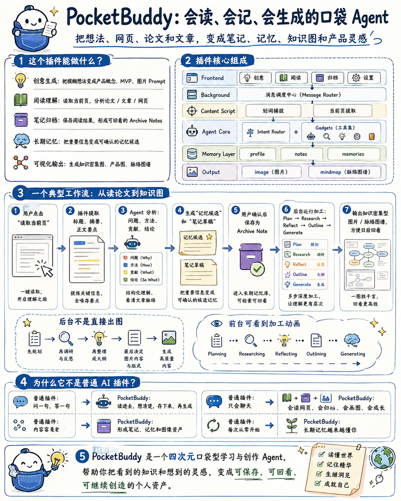

# duola_make_dream · PocketBuddy

PocketAgent 是脑子，PocketBuddy 是脸。

它会把你在网页里冒出来的点子、划到的碎片、读到的内容，慢慢揉成计划、笔记、图谱和图片。

---

## 先看一眼

<p align="center">
  
</p>

---

## 四个小家伙

这 4 个头像就是 PocketAgent 的四种小脾气。

<table>
  <tr>
    <td align="center" width="25%">
      <br/>
      <strong>云屿 PocketBuddy</strong><br/>
      脑洞大一点，先发散再收束
    </td>
    <td align="center" width="25%">
      <br/>
      <strong>小口袋云云</strong><br/>
      最软萌，负责陪你一起开始
    </td>
    <td align="center" width="25%">
      <br/>
      <strong>蓝白口袋精灵</strong><br/>
      更利落一点，适合做图标和工作台
    </td>
    <td align="center" width="25%">
      <br/>
      <strong>星澈 PocketAgent</strong><br/>
      更稳、更认真，适合分析和总结
    </td>
  </tr>
</table>

---

## 它平时会干啥

- 你丢一句想法，它先帮你搭计划，再慢慢长成一张好看的结果卡
- 你把网页喂给它，它会帮你提重点、做笔记、长出节点
- 你划一点碎片，它会先收着，攒多了再帮你整理
- 你生成的图片、笔记、经验，都会留在本地，想看就能翻出来

---

## 五个小房间

- `发明`：输入想法，先出计划，再决定要不要生图
- `喂养`：读网页、论文、文章，长出知识节点
- `记忆`：看成果图和网页笔记的图谱
- `观察`：看成功和失败，少点废话，多点经验
- `设置`：换头像、调画像、配模型、加技能和工具

---

## 它会产出什么

- `plan board`：想法到计划的可视化面板
- `graph view`：计划图、知识图、记忆图、经验图
- `note card`：网页阅读后生成的笔记卡
- `mindmap`：思维导图 / 图谱
- `image`：计划图、知识卡、海报类图片
- `experience record`：成功 / 失败经验沉淀

---

## 网页侧入口

网页里那个小悬浮入口，已经不是普通图片按钮了。

- 用 `three.js` 做了一个 3D 小宠物
- 还会保留“划词后放进口袋”的老语义
- 能 hover、会呼吸、会眨眼、会轻轻晃
- 如果 WebGL 不行，或者你开了 `prefers-reduced-motion`，它会乖乖退回 PNG 头像

---

## 模型开箱

开发期不想每次都手动配一遍，也已经想到了。

- `pnpm dev` / `pnpm build` / `pnpm compile` 会先跑本地配置注入脚本
- 你可以把 LLM 和图片模型相关的 key / url / model 放进 `.env`
- 脚本会把这些值写到本机的 `config/local-runtime-config.json`
- 设置页里保存模型档后，会顺手做一次连通性测试
- 返回 `200` 就说明这档模型能用

---

## 隐私

- 核心数据都留在本机浏览器里
- API Key 只用于本机请求，不会被塞去别的地方
- 划词和网页提取会避开输入框、密码框和聊天框
- 动画会尊重 `prefers-reduced-motion`

---

## 开发

```bash
pnpm install
pnpm dev
pnpm dev:firefox
pnpm compile
pnpm build
pnpm build:firefox
pnpm zip
pnpm zip:firefox
```

想做质量检查的话：

```bash
pnpm privacy-check
node scripts/e2e-final.mjs
node scripts/e2e-deep.mjs
```

---

## 代码入口

- [`entrypoints/background.ts`](/D:/DevProject/duola_make_dream/entrypoints/background.ts)
- [`entrypoints/content.ts`](/D:/DevProject/duola_make_dream/entrypoints/content.ts)
- [`entrypoints/sidepanel/App.tsx`](/D:/DevProject/duola_make_dream/entrypoints/sidepanel/App.tsx)
- [`entrypoints/sidepanel/pages/InventPage.tsx`](/D:/DevProject/duola_make_dream/entrypoints/sidepanel/pages/InventPage.tsx)
- [`entrypoints/sidepanel/pages/FeedPage.tsx`](/D:/DevProject/duola_make_dream/entrypoints/sidepanel/pages/FeedPage.tsx)
- [`entrypoints/sidepanel/pages/MemoryPage.tsx`](/D:/DevProject/duola_make_dream/entrypoints/sidepanel/pages/MemoryPage.tsx)
- [`entrypoints/sidepanel/pages/ObservePage.tsx`](/D:/DevProject/duola_make_dream/entrypoints/sidepanel/pages/ObservePage.tsx)
- [`entrypoints/sidepanel/pages/SettingsPage.tsx`](/D:/DevProject/duola_make_dream/entrypoints/sidepanel/pages/SettingsPage.tsx)

---

## 一句话收尾

PocketBuddy 负责可爱地陪着你，PocketAgent 负责认真地把你的想法变成作品。

