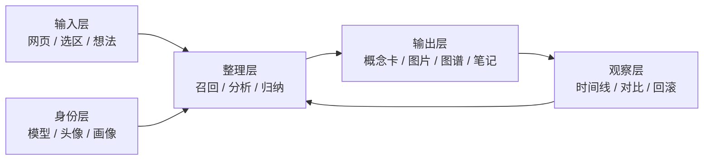

# PocketBuddy UI 精简与可视化方案

## 目标

把当前偏“说明书 / 管理台”的插件，收敛成一个更像专业 agent 产品的工作台：

- 一个主要操作面
- 一个主要结果面
- 一个主要证据面
- 一个主要观察面

减少长段文字和重复列表，让用户更快理解：

- 我喂了什么
- Agent 想了什么
- 产出了什么
- 这些输入如何改变了记忆和输出

## 当前主要冗余

### 1. 阅读页和创意页存在重复召回

两个页面都在做“关联召回 + 列表卡片 + 复制/送入输入框”，只是语境不同。

建议：
- 把召回能力抽成统一组件
- 在创意页和阅读页使用同一套“关联线索面板”
- 只保留一个主召回入口，另一个页面采用折叠展示

### 2. 观察页信息太散

观察页现在把这些都铺开了：

- 组件状态
- 因果链
- 时间线
- 画像历史
- 备份回滚
- 产物版本对比
- 图片版本对比
- 补丁历史
- 长期记忆
- 图片记录
- 图谱记录

建议：
- 默认只保留 3 个主卡片
- 其余内容放到折叠区或侧栏抽屉
- 观察页变成“仪表盘”，不是“历史仓库”

### 3. 归档页和观察页有重叠

归档页目前主要在做：

- 列出笔记
- 搜索过滤
- 查看详情
- 删除
- 从笔记生成图片或图谱

这些能力和阅读页、观察页有明显重叠。

建议：
- 归档页并入阅读页的右侧抽屉，或并入观察页的“知识库”模块
- 如果继续保留单独页面，只保留“笔记管理”这一项核心能力

### 4. 设置页过于像后台表单

设置页同时承载：

- agent 身份
- 用户画像
- LLM 配置
- 图片配置
- 数据清除

建议：
- 默认只露出最重要的身份和模型配置
- 画像和高级配置折叠到次级面板
- 数据清除移到危险区，不要和主流程并排

## 推荐的新信息架构

### 推荐页面

1. 创作台
2. 喂养台
3. 记忆台
4. 观察台
5. 设置页作为右侧抽屉或独立轻量页

### 推荐收敛方式

- 创作台负责“想法 -> 产品雏形”
- 喂养台负责“网页 -> 养料 -> 记忆候选”
- 记忆台负责“笔记 / 长期记忆 / 产物库”
- 观察台负责“变化、版本、回滚、趋势”
- 设置页负责“身份和模型”

## 哪些文字块适合改成图表

### 适合做图表或结构图

- 页面摘要、关键观点、要点、机会点
- 想法、产物、反馈、画像变化
- 备份、回滚、补丁历史
- 产物版本对比、图片版本对比
- 记忆候选和长期记忆之间的关系

### 适合做关系图

- 网页片段 -> 页面上下文 -> 笔记 -> 记忆候选 -> 长期记忆
- 想法 -> 产品概念 -> 图片 Prompt -> MVP -> 反馈
- 反馈 -> 画像变化 -> 下一次输出

### 适合做时间线

- 想法生成时间线
- 画像变化时间线
- 补丁和回滚时间线

### 适合做对比视图

- 版本 A / 版本 B
- 修改前 / 修改后
- 这次输入 / 上次输入

## 页面级改造建议

### 创作页

保留：
- 想法输入
- 产物卡
- 反馈按钮

合并：
- 关联召回和“最近线索”
- 把长说明改成一张“创作雷达图”或“线索卡”

### 阅读页

保留：
- 读取当前页
- 分析并喂养
- 保存为笔记

合并：
- 页面摘要、关键观点、可记住信息、产品机会、召回线索
- 用“阅读地图”替代多个独立文字卡

### 归档/记忆页

保留：
- 搜索
- 过滤
- 删除
- 详情查看

改造：
- 左侧列表 + 右侧详情抽屉
- 重点展示标签、来源、关联上下文，不展开一大段文字

### 观察页

默认只显示：
- 3-4 个总览 KPI
- 一张演化时间线
- 一张当前画像卡

高级内容放到折叠区：
- 快照对比
- 产物对比
- 图片对比
- 补丁历史
- 原始记录列表

### 设置页

默认只显示：
- Agent 名称
- 头像
- LLM 模式
- 图片模式

高级内容折叠：
- 画像编辑
- API key
- 数据管理

## Agent 是否真的在起作用

当前结论是：

- 能起作用，且主闭环已经成立
- 但它更像“受控编排的 local-first agent”，不是完全自治的 agent

已经能做的事情：

- 帮用户整理想法
- 把想法收束成产品概念和 MVP
- 生成图片 Prompt，必要时接真实图片代理
- 收集网页信息并保存为养料
- 生成笔记、图谱、历史记录

还不够强的地方：

- 语义记忆还不够
- 主动性不够
- 可视化不够统一
- 真实模型验证还不够完整

## 验证标准

### 功能验证

- 输入一句想法，能稳定生成产品概念
- 读取网页后，能形成页面上下文和记忆候选
- 保存笔记后，能在记忆台看到关联关系
- 生成图片和图谱后，能在观察台看到记录

### 视觉验证

- 默认页面不出现一屏超过 4 个独立长文字块
- 每个页面至少有一个主视觉聚焦区
- 细节信息可折叠，不干扰主流程

### Agent 验证

- 用户能看懂输入如何变成输出
- 用户能看懂输出如何影响记忆和画像
- 用户能看懂这次变化和上次有什么区别

## 建议的下一步

1. 先合并重复召回和重复历史区。
2. 再把观察页重做成仪表盘。
3. 再把归档并入记忆/阅读，不单独占一个大页。
4. 最后补一个真实模型 smoke test，确认 live LLM 和 image proxy 的效果。
